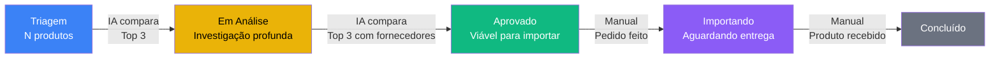
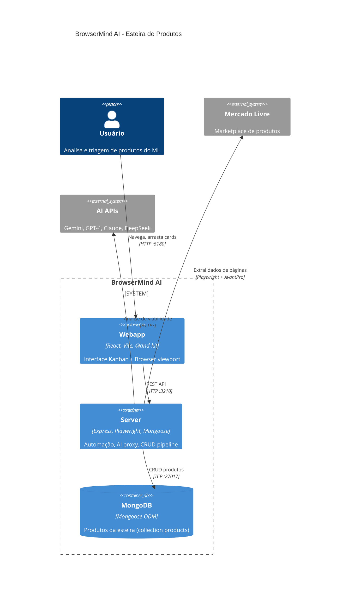
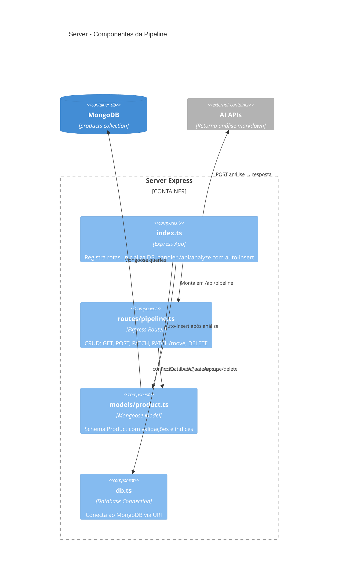
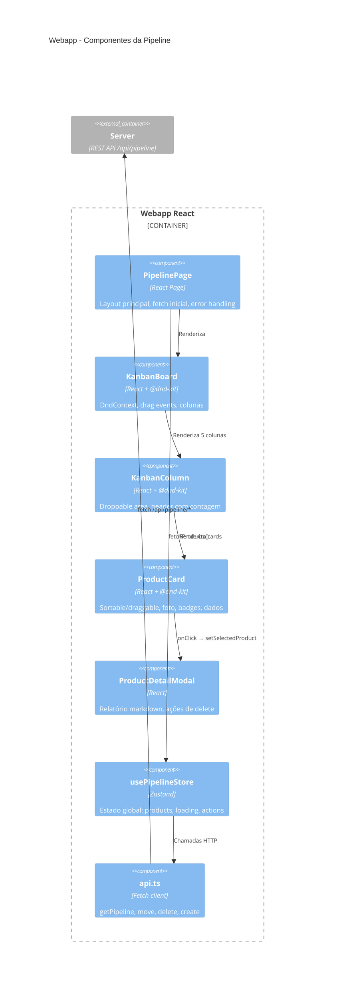
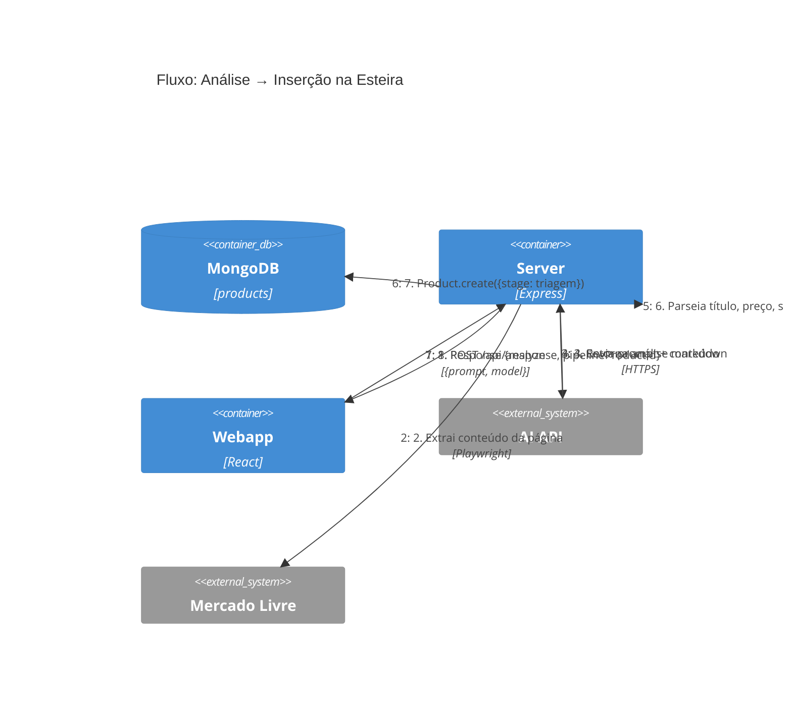

# Esteira de Produtos (Pipeline)

Sistema de triagem e acompanhamento de produtos no estilo Kanban (Trello/Monday) com persistência em MongoDB.

## Índice

- [Visão Geral](#visão-geral)
- [Colunas](#colunas)
- [Comparação de Produtos por Coluna](#comparação-de-produtos-por-coluna)
  - [Triagem → Em Análise](#triagem--em-análise)
  - [Em Análise → Aprovado](#em-análise--aprovado)
  - [Aprovado → Importando](#aprovado--importando)
  - [Importando → Concluído](#importando--concluído)
  - [Resumo do Fluxo de Decisão](#resumo-do-fluxo-de-decisão)
  - [Endpoint de Comparação](#endpoint-de-comparação)
- [Fluxo de Inserção Automática](#fluxo-de-inserção-automática)
- [Card do Produto](#card-do-produto)
- [Interações](#interações)
- [API Endpoints](#api-endpoints)
- [Schema do Produto (MongoDB)](#schema-do-produto-mongodb)
- [Pré-requisitos](#pré-requisitos)
- [Arquitetura](#arquitetura)
- [Testes](#testes)
- [Como Acessar](#como-acessar)

## Visão Geral

Quando a IA analisa um produto e identifica dados de viabilidade (score, vendas, concorrência, margem), o produto é **automaticamente inserido** na esteira de triagem. A partir daí, o usuário pode movê-lo entre as colunas conforme avança no processo de avaliação e importação.

## Colunas

| Coluna | Descrição |
|--------|-----------|
| **Triagem** | Produto recém-analisado, aguardando avaliação inicial |
| **Em Análise** | Produto sendo investigado mais a fundo (fornecedores, margem real) |
| **Aprovado** | Produto validado como viável para importação/venda |
| **Importando** | Pedido em andamento com fornecedor |
| **Concluído** | Produto já em estoque ou processo finalizado |

## Comparação de Produtos por Coluna

O sistema oferece uma **comparação assistida por IA** que avalia todos os produtos de uma coluna e sugere os Top 3 para avançar ao próximo estágio. O botão de comparar (ícone de balança) aparece no header da coluna quando há ≥3 produtos.

### Triagem → Em Análise

**Objetivo:** Filtrar os produtos mais promissores dentre os recém-analisados para investigação aprofundada.

**Dados disponíveis neste estágio:**
- Score de demanda (0-10) — extraído automaticamente do relatório da IA
- Vendas mensais estimadas
- Nível de concorrência (Baixa/Média/Alta/Saturado)
- Margem potencial estimada (texto)
- Categoria do Mercado Livre
- Preço de venda no ML

**Critérios que a IA avalia:**
| Critério | Peso | Justificativa |
|----------|------|---------------|
| Score de demanda | Alto | Indica volume de mercado comprovado |
| Vendas mensais | Alto | Volume real valida a demanda |
| Concorrência | Médio-alto | Menor concorrência = mais margem de entrada |
| Margem potencial | Médio | Indica rentabilidade esperada |
| Escalabilidade | Médio | Capacidade de crescer após primeiro pedido |
| Diferenciação | Baixo-médio | Possibilidade de se destacar no mercado |

**O que a IA entrega:**
1. Ranking dos Top 3 com justificativa individual
2. Tabela comparativa de todos os produtos (métricas lado a lado)
3. Análise detalhada de pontos fortes e fracos de cada top 3
4. Recomendação final

**Ação do usuário:** Revisa o ranking, seleciona/deseleciona produtos via checkbox, e confirma para mover os selecionados para "Em Análise".

---

### Em Análise → Aprovado

**Objetivo:** Decidir quais produtos são viáveis para importação real com base em dados concretos de fornecedores.

**Dados disponíveis neste estágio (adicionais):**
- Fornecedores capturados do Alibaba (nome, preço unitário, MOQ, rating, Trade Assurance, anos de operação, taxa de resposta, certificações)
- Relatório de fornecedores (markdown detalhado)
- Todos os dados da triagem (score, vendas, concorrência, preço ML)

**Critérios que a IA avalia:**
| Critério | Peso | Justificativa |
|----------|------|---------------|
| Margem real estimada | Muito alto | `preço_venda - custo_unitário - frete - taxas_ML - impostos (~60%)` |
| Viabilidade do MOQ | Alto | Pedido mínimo compatível com teste inicial? |
| Confiabilidade do fornecedor | Alto | Rating ≥4.5, anos ≥3, Trade Assurance ativo |
| Risco operacional | Médio-alto | Produto frágil? Certificações obrigatórias? Risco alfandegário? |
| Taxa de resposta do fornecedor | Médio | Comunicação é crítica em importação |
| Potencial de escala | Médio | Se funcionar, dá pra crescer? |
| Capacidade OEM/ODM | Baixo | Customização futura possível? |

**Cálculo simplificado de margem que a IA considera:**
```
Custo total estimado = preço_unitário_USD × câmbio × 1.60 (impostos) + frete
Margem bruta = (preço_venda_ML - custo_total) / preço_venda_ML × 100
```

**O que a IA entrega:**
1. Ranking dos Top 3 com foco em viabilidade financeira
2. Tabela comparativa incluindo custo estimado, margem bruta e nível de risco
3. Análise detalhada de viabilidade operacional e financeira
4. Recomendação final com justificativa para aprovação

**Ação do usuário:** Revisa o ranking, valida margens e riscos, confirma para mover os selecionados para "Aprovado".

---

### Aprovado → Importando

**Transição manual.** Neste ponto o usuário já validou tudo e está fazendo o pedido com o fornecedor. Move-se o card quando:
- Contato com fornecedor estabelecido
- Pedido de amostra ou lote inicial confirmado
- Pagamento realizado (Trade Assurance)

**Não há comparação automatizada** — cada produto aprovado avança individualmente conforme o andamento da negociação.

---

### Importando → Concluído

**Transição manual.** Move-se o card quando:
- Produto recebido e conferido
- Listado no Mercado Livre (ou estoque recebido)
- Processo finalizado com sucesso (ou cancelado)

---

### Resumo do Fluxo de Decisão



### Endpoint de Comparação

```
POST /api/pipeline/compare
```

**Body:**
```json
{
  "model": "gemini-flash-2.5",
  "stage": "triagem"
}
```

- `model` (obrigatório): modelo de IA a utilizar
- `stage` (opcional, default: `"triagem"`): coluna a comparar (`"triagem"` ou `"analise"`)

**Response:**
```json
{
  "success": true,
  "comparison": {
    "ranking": [
      { "productId": "...", "position": 1, "reason": "Melhor margem e baixa concorrência" },
      { "productId": "...", "position": 2, "reason": "Alto volume de vendas" },
      { "productId": "...", "position": 3, "reason": "Fornecedor confiável e MOQ baixo" }
    ],
    "report": "## Tabela Comparativa\n...",
    "productsCompared": 7
  }
}
```

**Erros:**
- `400` — Menos de 3 produtos no stage, ou stage inválido
- `500` — Falha na chamada à IA ou parsing

## Fluxo de Inserção Automática

```
Usuário faz análise de viabilidade (prompt + IA)
        ↓
IA retorna relatório com dados estruturados
        ↓
Server detecta dados de viabilidade na resposta:
  - Score, demanda, concorrência, margem, vendas mensais
        ↓
Extrai automaticamente:
  - Título, preço, URL, imagem (og:image)
  - Score, vendas mensais, nível de concorrência
  - Margem potencial, categoria
  - Relatório completo (markdown)
        ↓
Produto inserido na coluna "Triagem" com order auto-incrementado
```

## Card do Produto

Cada card no Kanban exibe:

- **Foto** do produto (extraída via `og:image` da página)
- **Título** do anúncio (até 200 caracteres)
- **Preço** em R$
- **Score** de demanda (0-10) com ícone estrela
- **Vendas mensais** estimadas com ícone de tendência
- **Nível de concorrência** — badge colorido:
  - 🟢 Baixa — verde
  - 🟡 Média — amarelo
  - 🟠 Alta — laranja
  - 🔴 Saturado — vermelho
- **Categoria** do Mercado Livre
- **Link externo** para o anúncio original

## Interações

| Ação | Descrição |
|------|-----------|
| **Drag-and-drop** | Arraste cards entre colunas para atualizar o status |
| **Clique no card** | Abre modal com o relatório completo da análise (markdown renderizado) |
| **Excluir** | Remove produto da esteira (botão no modal de detalhes) |
| **Link externo** | Abre o anúncio no Mercado Livre em nova aba |
| **Atualizar** | Botão para recarregar dados do servidor |

## API Endpoints

| Método | Rota | Descrição |
|--------|------|-----------|
| `GET` | `/api/pipeline` | Lista todos os produtos agrupados por stage |
| `POST` | `/api/pipeline` | Cria produto na esteira (stage: triagem) |
| `PATCH` | `/api/pipeline/:id` | Atualiza campos do produto |
| `PATCH` | `/api/pipeline/:id/move` | Move produto para outra coluna (stage + order) |
| `DELETE` | `/api/pipeline/:id` | Remove produto da esteira |

### Exemplo: Criar produto

```bash
curl -X POST http://localhost:3210/api/pipeline \
  -H "Content-Type: application/json" \
  -d '{
    "title": "Película Galaxy S24 Ultra",
    "url": "https://www.mercadolivre.com.br/pelicula-s24/p/MLB123",
    "price": 29.90,
    "score": 8,
    "monthlySales": 1200,
    "competitionLevel": "Baixa",
    "category": "Celulares > Películas"
  }'
```

### Exemplo: Mover produto

```bash
curl -X PATCH http://localhost:3210/api/pipeline/PRODUCT_ID/move \
  -H "Content-Type: application/json" \
  -d '{ "stage": "analise", "order": 0 }'
```

## Schema do Produto (MongoDB)

```typescript
{
  title: string              // Título do produto (obrigatório)
  url: string                // URL do anúncio no ML (obrigatório)
  imageUrl: string           // URL da imagem (og:image)
  price: number              // Preço em R$
  category: string           // Categoria do ML
  stage: PipelineStage       // "triagem" | "analise" | "aprovado" | "importando" | "concluido"
  score: number              // Score de demanda (0-10)
  monthlySales: number       // Vendas mensais estimadas
  competitionLevel: string   // "Baixa" | "Média" | "Alta" | "Saturado"
  potentialMargin: string    // Margem potencial (texto livre)
  analysisReport: string     // Relatório completo em markdown
  analyzedAt: Date           // Data da análise
  order: number              // Posição na coluna (para ordenação)
  createdAt: Date            // Auto-gerado
  updatedAt: Date            // Auto-gerado
}
```

## Pré-requisitos

### MongoDB

O MongoDB deve estar rodando na porta 27017. Para iniciar com Docker:

```bash
docker compose up -d
```

O container `browsermind-mongo` será criado com volume persistente `mongo_data`.

### Variáveis de Ambiente

| Variável | Padrão | Descrição |
|----------|--------|-----------|
| `MONGODB_URI` | `mongodb://localhost:27017/browsermind` | URI de conexão com o MongoDB |

## Arquitetura

### C4 Container — Visão do Sistema



### C4 Component — Server (Pipeline)



### C4 Component — Webapp (Pipeline)



### C4 Dynamic — Fluxo de Inserção Automática



### Estrutura de Arquivos

```
webapp/src/
├── pages/PipelinePage.tsx                    # Página principal da esteira
├── components/pipeline/
│   ├── KanbanBoard.tsx                       # DndContext + layout das colunas
│   ├── KanbanColumn.tsx                      # Coluna droppable com header e cards
│   ├── ProductCard.tsx                       # Card draggable com dados resumidos
│   └── ProductDetailModal.tsx                # Modal com relatório markdown
├── store/usePipelineStore.ts                 # Zustand store (fetch, move, delete)
└── lib/api.ts                                # Funções de API da pipeline

server/src/
├── db.ts                                     # Conexão MongoDB (mongoose)
├── models/product.ts                         # Schema e model do produto
└── routes/pipeline.ts                        # Handlers CRUD das rotas
```

## Testes

```bash
# Todos os testes do server (unit + integration + E2E)
cd server && npm test

# Testes do webapp (store)
cd webapp && npm test
```

Os testes usam `mongodb-memory-server` e `supertest` — não dependem de MongoDB real rodando.

### Cobertura de testes

| Tipo | Arquivo | Testes |
|------|---------|--------|
| Unit | `server/src/__tests__/pipeline.test.ts` | Regexes de parsing, constantes, extração de dados |
| Integration | `server/src/__tests__/pipeline-integration.test.ts` | CRUD do model, queries, movimentação |
| E2E | `server/src/__tests__/pipeline-e2e.test.ts` | Rotas HTTP completas com supertest |
| Unit | `webapp/src/store/__tests__/usePipelineStore.test.ts` | Store actions, loading, errors |

## Como Acessar

1. Na barra de navegação superior, clique no botão **"Esteira"**
2. Ou acesse diretamente: `http://localhost:5180/pipeline`
3. Para voltar à view principal do browser, clique em **"Browser"**
