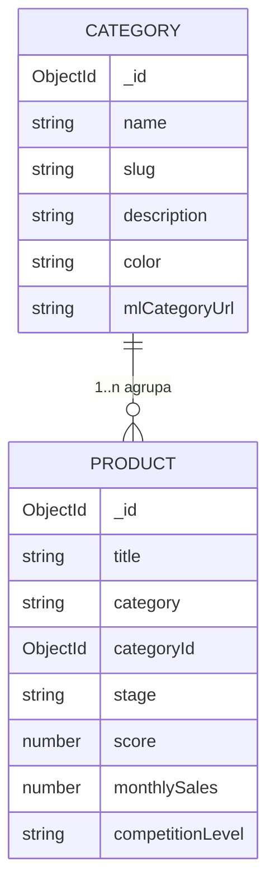

# Plano de Implementação — Categoria na Pipeline de Produtos

> **Branch:** `feature/category-pipeline`
> **Escopo aprovado:** Entidade de categoria completa (CRUD + dashboard agregado + filtro no Kanban).

## 1. Objetivo

Transformar "categoria" de um campo de texto livre (`product.category`) em uma **entidade de primeira classe** na esteira de produtos, permitindo:

- Criar, editar e remover categorias (CRUD).
- Vincular produtos a uma categoria.
- Filtrar/agrupar produtos por categoria no Kanban.
- Visualizar métricas agregadas por categoria (dashboard).

## 2. Estado Atual

- `Product.category` é `String` livre (default `""`), extraída do relatório da IA via regex `Categoria\s*:\s*(.+)` em `server/src/index.ts`.
- Exibida em `ProductCard.tsx` ("Sem categoria" quando vazia) e em `ProductDetailPage.tsx`.
- Usada nos prompts de comparação (`server/src/index.ts` linhas ~1278 e ~1292).
- **Não há** agrupamento, filtro, gestão ou normalização de categorias.

## 3. Modelo de Dados

### 3.1 Nova entidade `Category`

Novo arquivo `server/src/models/category.ts`:

| Campo | Tipo | Descrição |
|-------|------|-----------|
| `name` | `String` (required, unique) | Nome da categoria (ex: "Películas para Celular") |
| `slug` | `String` (unique) | Slug gerado a partir do nome (lowercase, hífens) |
| `description` | `String` | Descrição livre |
| `color` | `String` (default `"#3b82f6"`) | Cor do badge/identidade visual |
| `mlCategoryUrl` | `String` | URL da categoria no Mercado Livre (opcional) |
| `createdAt` / `updatedAt` | timestamps | via `{ timestamps: true }` |

Índices: `{ name: 1 }` único e `{ slug: 1 }` único.

### 3.2 Alteração em `Product` (`server/src/models/product.ts`)

Manter `category` (string bruta do Mercado Livre, retrocompatibilidade) e adicionar:

| Campo | Tipo | Descrição |
|-------|------|-----------|
| `categoryId` | `ObjectId` (ref: `"Category"`, default `null`) | Vínculo normalizado com a entidade `Category` |

> **Decisão:** `category` continua sendo o rótulo bruto extraído do relatório; `categoryId` é o vínculo estruturado. Quando `categoryId` está definido, o nome da categoria passa a ser o rótulo exibido no card (com fallback para `category`).



## 4. Backend

### 4.1 Novas rotas — `server/src/routes/categories.ts`

| Método | Rota | Descrição |
|--------|------|-----------|
| `GET` | `/api/categories` | Lista categorias com contagem de produtos (via `$lookup`/aggregation) |
| `POST` | `/api/categories` | Cria categoria (gera `slug` a partir do nome) |
| `GET` | `/api/categories/:id` | Detalhe da categoria + produtos vinculados + métricas agregadas |
| `PATCH` | `/api/categories/:id` | Atualiza categoria |
| `DELETE` | `/api/categories/:id` | Remove categoria (desvincula produtos, definindo `categoryId: null`) |
| `PATCH` | `/api/pipeline/:id/category` | Atribui/remove categoria em um produto (`{ categoryId }`) |

Registrar em `server/src/index.ts`:

```ts
app.use("/api/categories", categoriesRouter)
```

### 4.2 Métricas agregadas do dashboard (`GET /api/categories/:id`)

Via aggregation pipeline sobre `Product` filtrado por `categoryId`:

- Total de produtos na categoria.
- Distribuição por `stage` (5 colunas).
- Score médio, vendas mensais somadas, distribuição de `competitionLevel`.
- Quantidade de fornecedores com cotação (`suppliers.quotes` não vazio).
- Faturamento potencial estimado (soma de `price`).

### 4.3 Auto-vínculo na análise (`server/src/index.ts`)

No bloco de auto-inserção (linhas ~582–604), após extrair `categoryMatch`:

1. Normalizar o valor de `category` (trim, minúsculas, remover acentos/asteriscos).
2. Buscar `Category` por `slug` ou `name` (case-insensitive).
3. Se existir → vincular `categoryId`; senão → manter `categoryId: null` (criação manual pelo usuário via UI) ou criar automaticamente (toggle de configuração futuro).

## 5. Webapp

### 5.1 Cliente HTTP — `webapp/src/lib/api.ts`

- Tipo `Category` + `CategoryDashboard` (métricas agregadas).
- Métodos: `getCategories()`, `createCategory()`, `updateCategory()`, `deleteCategory()`, `getCategory(id)`, `assignCategoryToProduct(productId, categoryId)`.

### 5.2 Store — `webapp/src/store/useCategoryStore.ts` (novo)

Estado: `categories`, `selectedCategoryId` (filtro), `isLoading`, `error`.
Métodos: `fetchCategories()`, `createCategory()`, `updateCategory()`, `deleteCategory()`, `assignCategory()`, `setFilter(categoryId | null)`.

### 5.3 Páginas

| Arquivo | Descrição |
|---------|-----------|
| `webapp/src/pages/CategoriesPage.tsx` | Gestão de categorias: lista + modal de criar/editar (nome, cor, descrição, URL) |
| `webapp/src/pages/CategoryDashboardPage.tsx` | Dashboard da categoria: KPIs + distribuição por stage + cards de produtos |

### 5.4 Componentes alterados

> **Decisão de UX:** no Kanban, a categoria entra como **atributo visual + filtro**, não como segundo eixo de agrupamento. O eixo principal permanece o estágio (funil de decisão). O agrupamento por categoria dentro da coluna é um toggle **desligado por padrão**.

| Arquivo | Alteração | Prioridade |
|---------|-----------|------------|
| `KanbanBoard.tsx` | Barra de filtro por categoria (dropdown "Todas as categorias") acima das colunas | Obrigatório |
| `ProductCard.tsx` | Badge colorido da categoria (fallback para `category`), tooltip | Obrigatório |
| `KanbanColumn.tsx` | Agrupar por categoria dentro da coluna — toggle desligado por padrão | Opcional |
| `ProductDetailPage.tsx` | Seletor de categoria (assign/editar) no header ou tab "produto" | Obrigatório |

### 5.5 Navegação e rotas

- `App.tsx`: adicionar rotas `/categories` e `/categories/:id`.
- `NavigationBar.tsx`: botão "Categorias" (ícone `Tag` do `lucide-react`), seguindo o padrão dos botões existentes.

## 6. Migração de dados

Script one-time (`server/src/scripts/migrate-categories.ts` ou endpoint dev):

1. Agrupar `Product.category` distintos e não vazios.
2. Criar uma `Category` para cada valor distinto (slug normalizado).
3. Atualizar `Product.categoryId` correspondente.
4. `category` permanece intacto.

## 7. Testes

| Arquivo | Cobertura |
|---------|-----------|
| `server/src/__tests__/category.test.ts` | CRUD de categorias, slug único, delete desvinculando produtos |
| `server/src/__tests__/pipeline-integration.test.ts` | Extensão: vínculo `categoryId` + auto-vínculo por nome |
| `webapp/src/store/__tests__/useCategoryStore.test.ts` | Estado e ações do store de categorias |

## 8. Fases de Implementação

- [ ] **Fase 1 — Modelo + rotas:** `Category` model, `categoryId` no Product, rotas CRUD em `routes/categories.ts`, registro no `index.ts`.
- [ ] **Fase 2 — Auto-vínculo:** normalização e match por nome no fluxo de análise.
- [ ] **Fase 3 — API client + store:** tipos e métodos em `api.ts`, novo `useCategoryStore.ts`.
- [ ] **Fase 4 — Gestão de categorias:** `CategoriesPage.tsx` + modal de criar/editar.
- [ ] **Fase 5 — Filtro no Kanban:** dropdown de filtro por categoria (obrigatório) + badge colorido no `ProductCard` (obrigatório). Agrupamento por categoria na coluna: opcional, toggle desligado por padrão.
- [ ] **Fase 6 — Dashboard:** `CategoryDashboardPage.tsx` + `GET /api/categories/:id` com aggregation.
- [ ] **Fase 7 — Navegação:** rotas no `App.tsx` + botão "Categorias" no `NavigationBar`.
- [ ] **Fase 8 — Testes + migração:** testes unitários/integração + script de migração de `category` existentes.

## 9. Convenções a seguir

- Código em inglês (nomes de variáveis/tipos/funções); comentários e docs em inglês; respostas em português.
- Sem ponto-e-vírgula; aspas duplas; `type` em vez de `interface`.
- Rotas Express com try/catch retornando `{ success, ...data }` ou `{ error }`.
- Webapp usa `fetch` direto via `api`; estado global via Zustand; CSS via Tailwind.
- Nova rota → handler no server, proxy em `vite.config.ts` (já cobre `/api`), função no cliente `api.ts`.

## 10. Critérios de aceite

1. Criar/editar/remover categoria pela UI e refletir nos produtos.
2. Produto aceita vínculo de categoria e exibe badge colorido no Kanban.
3. Filtro por categoria funciona no Kanban sem quebrar drag-and-drop.
4. Dashboard mostra métricas agregadas corretas por categoria.
5. Análise de produto com categoria já existente vincula à categoria automaticamente.
6. Testes passando (`npm test` no server e no webapp).
