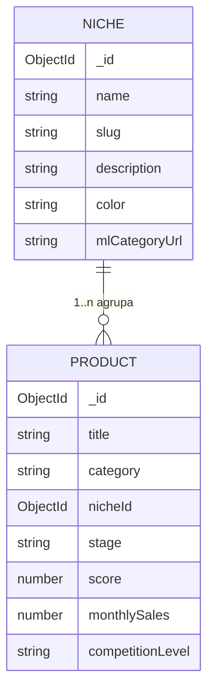

# Plano de Implementação — Nicho/Categoria na Pipeline de Produtos

> **Branch:** `feature/niche-category-pipeline`
> **Escopo aprovado:** Entidade de nicho completa (CRUD + dashboard agregado + filtro no Kanban).

## 1. Objetivo

Transformar "nicho/categoria" de um campo de texto livre (`product.category`) em uma **entidade de primeira classe** na esteira de produtos, permitindo:

- Criar, editar e remover nichos (CRUD).
- Vincular produtos a um nicho.
- Filtrar/agrupar produtos por nicho no Kanban.
- Visualizar métricas agregadas por nicho (dashboard).

## 2. Estado Atual

- `Product.category` é `String` livre (default `""`), extraída do relatório da IA via regex `Categoria\s*:\s*(.+)` em `server/src/index.ts`.
- Exibida em `ProductCard.tsx` ("Sem categoria" quando vazia) e em `ProductDetailPage.tsx`.
- Usada nos prompts de comparação (`server/src/index.ts` linhas ~1278 e ~1292).
- **Não há** agrupamento, filtro, gestão ou normalização de nichos.

## 3. Modelo de Dados

### 3.1 Nova entidade `Niche`

Novo arquivo `server/src/models/niche.ts`:

| Campo | Tipo | Descrição |
|-------|------|-----------|
| `name` | `String` (required, unique) | Nome do nicho (ex: "Películas para Celular") |
| `slug` | `String` (unique) | Slug gerado a partir do nome (lowercase, hífens) |
| `description` | `String` | Descrição livre |
| `color` | `String` (default `"#3b82f6"`) | Cor do badge/identidade visual |
| `mlCategoryUrl` | `String` | URL da categoria no Mercado Livre (opcional) |
| `createdAt` / `updatedAt` | timestamps | via `{ timestamps: true }` |

Índices: `{ name: 1 }` único e `{ slug: 1 }` único.

### 3.2 Alteração em `Product` (`server/src/models/product.ts`)

Manter `category` (string bruta do Mercado Livre, retrocompatibilidade) e adicionar:

| Campo | Tipo | Descrição |
|-------|------|-----------|
| `nicheId` | `ObjectId` (ref: `"Niche"`, default `null`) | Vínculo normalizado com o nicho |

> **Decisão:** `category` continua sendo o rótulo bruto extraído do relatório; `nicheId` é o vínculo estruturado. Quando `nicheId` está definido, o nome do nicho passa a ser o rótulo exibido no card (com fallback para `category`).



## 4. Backend

### 4.1 Novas rotas — `server/src/routes/niches.ts`

| Método | Rota | Descrição |
|--------|------|-----------|
| `GET` | `/api/niches` | Lista nichos com contagem de produtos (via `$lookup`/aggregation) |
| `POST` | `/api/niches` | Cria nicho (gera `slug` a partir do nome) |
| `GET` | `/api/niches/:id` | Detalhe do nicho + produtos vinculados + métricas agregadas |
| `PATCH` | `/api/niches/:id` | Atualiza nicho |
| `DELETE` | `/api/niches/:id` | Remove nicho (desvincula produtos, definindo `nicheId: null`) |
| `PATCH` | `/api/pipeline/:id/niche` | Atribui/remove nicho em um produto (`{ nicheId }`) |

Registrar em `server/src/index.ts`:

```ts
app.use("/api/niches", nichesRouter)
```

### 4.2 Métricas agregadas do dashboard (`GET /api/niches/:id`)

Via aggregation pipeline sobre `Product` filtrado por `nicheId`:

- Total de produtos no nicho.
- Distribuição por `stage` (5 colunas).
- Score médio, vendas mensais somadas, distribuição de `competitionLevel`.
- Quantidade de fornecedores com cotação (`suppliers.quotes` não vazio).
- Faturamento potencial estimado (soma de `price`).

### 4.3 Auto-vínculo na análise (`server/src/index.ts`)

No bloco de auto-inserção (linhas ~582–604), após extrair `categoryMatch`:

1. Normalizar o valor de `category` (trim, minúsculas, remover acentos/asteriscos).
2. Buscar `Niche` por `slug` ou `name` (case-insensitive).
3. Se existir → vincular `nicheId`; senão → manter `nicheId: null` (criação manual pelo usuário via UI) ou criar automaticamente (toggle de configuração futuro).

## 5. Webapp

### 5.1 Cliente HTTP — `webapp/src/lib/api.ts`

- Tipo `Niche` + `NicheDashboard` (métricas agregadas).
- Métodos: `getNiches()`, `createNiche()`, `updateNiche()`, `deleteNiche()`, `getNiche(id)`, `assignNicheToProduct(productId, nicheId)`.

### 5.2 Store — `webapp/src/store/useNicheStore.ts` (novo)

Estado: `niches`, `selectedNicheId` (filtro), `isLoading`, `error`.
Métodos: `fetchNiches()`, `createNiche()`, `updateNiche()`, `deleteNiche()`, `assignNiche()`, `setFilter(nicheId | null)`.

### 5.3 Páginas

| Arquivo | Descrição |
|---------|-----------|
| `webapp/src/pages/NichesPage.tsx` | Gestão de nichos: lista + modal de criar/editar (nome, cor, descrição, URL) |
| `webapp/src/pages/NicheDashboardPage.tsx` | Dashboard do nicho: KPIs + distribuição por stage + cards de produtos |

### 5.4 Componentes alterados

| Arquivo | Alteração |
|---------|-----------|
| `KanbanBoard.tsx` | Barra de filtro por nicho (dropdown + "Todos") acima das colunas |
| `ProductCard.tsx` | Badge do nicho com cor (fallback para `category`), tooltip |
| `KanbanColumn.tsx` | (opcional) agrupar por nicho dentro da coluna quando filtro ativo |
| `ProductDetailPage.tsx` | Seletor de nicho (assign/editar) no header ou tab "produto" |

### 5.5 Navegação e rotas

- `App.tsx`: adicionar rotas `/niches` e `/niches/:id`.
- `NavigationBar.tsx`: botão "Nichos" (ícone `Tag` do `lucide-react`), seguindo o padrão dos botões existentes.

## 6. Migração de dados

Script one-time (`server/src/scripts/migrate-categories.ts` ou endpoint dev):

1. Agrupar `Product.category` distintos e não vazios.
2. Criar um `Niche` para cada valor distinto (slug normalizado).
3. Atualizar `Product.nicheId` correspondente.
4. `category` permanece intacto.

## 7. Testes

| Arquivo | Cobertura |
|---------|-----------|
| `server/src/__tests__/niche.test.ts` | CRUD de nichos, slug único, delete desvinculando produtos |
| `server/src/__tests__/pipeline-integration.test.ts` | Extensão: vínculo `nicheId` + auto-vínculo por nome |
| `webapp/src/store/__tests__/useNicheStore.test.ts` | Estado e ações do store de nichos |

## 8. Fases de Implementação

- [ ] **Fase 1 — Modelo + rotas:** `Niche` model, `nicheId` no Product, rotas CRUD em `routes/niches.ts`, registro no `index.ts`.
- [ ] **Fase 2 — Auto-vínculo:** normalização e match por nome no fluxo de análise.
- [ ] **Fase 3 — API client + store:** tipos e métodos em `api.ts`, novo `useNicheStore.ts`.
- [ ] **Fase 4 — Gestão de nichos:** `NichesPage.tsx` + modal de criar/editar.
- [ ] **Fase 5 — Filtro no Kanban:** dropdown de nicho + badge no `ProductCard`.
- [ ] **Fase 6 — Dashboard:** `NicheDashboardPage.tsx` + `GET /api/niches/:id` com aggregation.
- [ ] **Fase 7 — Navegação:** rotas no `App.tsx` + botão "Nichos" no `NavigationBar`.
- [ ] **Fase 8 — Testes + migração:** testes unitários/integração + script de migração de `category` existentes.

## 9. Convenções a seguir

- Código em inglês (nomes de variáveis/tipos/funções); comentários e docs em inglês; respostas em português.
- Sem ponto-e-vírgula; aspas duplas; `type` em vez de `interface`.
- Rotas Express com try/catch retornando `{ success, ...data }` ou `{ error }`.
- Webapp usa `fetch` direto via `api`; estado global via Zustand; CSS via Tailwind.
- Nova rota → handler no server, proxy em `vite.config.ts` (já cobre `/api`), função no cliente `api.ts`.

## 10. Critérios de aceite

1. Criar/editar/remover nicho pela UI e refletir nos produtos.
2. Produto aceita vínculo de nicho e exibe badge colorido no Kanban.
3. Filtro por nicho funciona no Kanban sem quebrar drag-and-drop.
4. Dashboard mostra métricas agregadas corretas por nicho.
5. Análise de produto com categoria já existente vincula ao nicho automaticamente.
6. Testes passando (`npm test` no server e no webapp).
